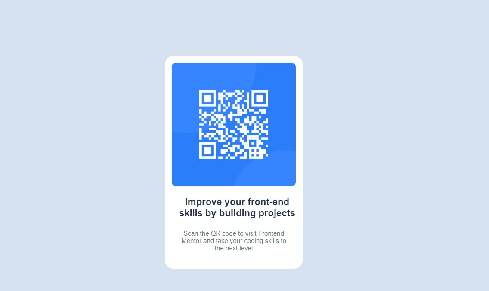

# QR code component solution

## Table of contents

- [Overview](#overview)
  - [Screenshot](#screenshot)
  - [Links](#links)
- [My process](#my-process)
  - [Built with](#built-with)
  - [What I learned](#what-i-learned)

## Overview

### Screenshot

### Links

- Solution URL: [Add solution URL here](https://github.com/VitaliySaburdo/QR-code-component)
- Live Site URL: [Add live site URL here](https://vitaliysaburdo.github.io/QR-code-component/)

## My process

### Built with

- Semantic HTML5 markup
- CSS custom properties

### What I learned

I repeated the basics of html< css, and also repeated the css text properties.
